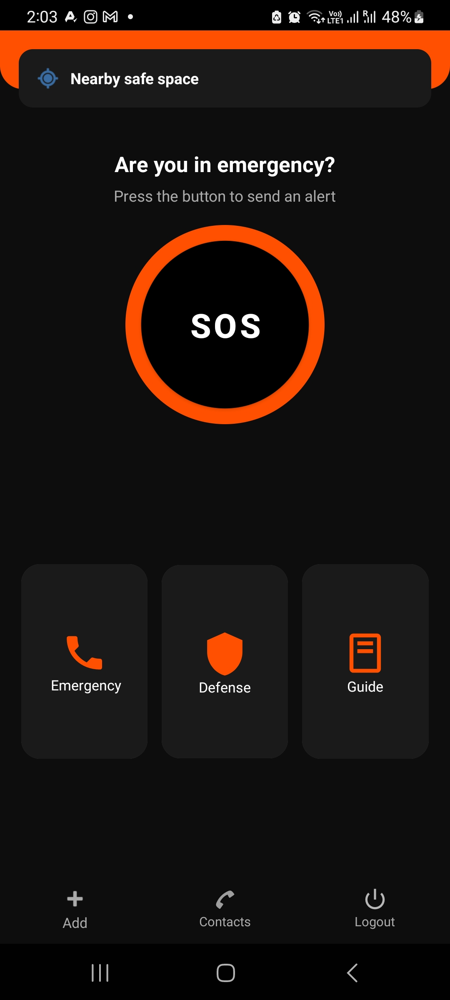
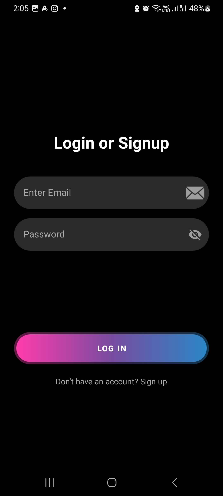
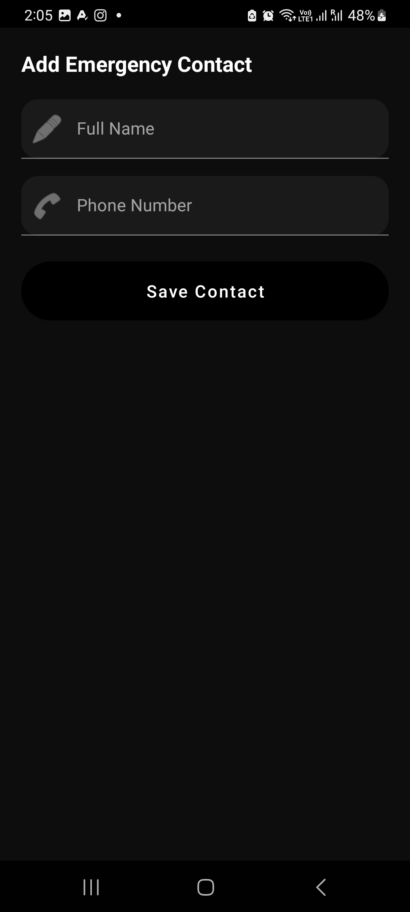
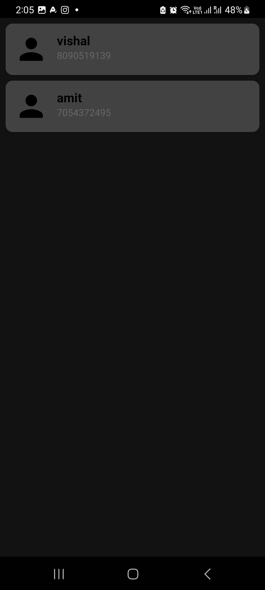

<a id="readme-top"></a>

<!-- PROJECT SHIELDS -->
[![Contributors][contributors-shield]][contributors-url]
[![Forks][forks-shield]][forks-url]
[![Stargazers][stars-shield]][stars-url]
[![Issues][issues-shield]][issues-url]
[![MIT License][license-shield]][license-url]

<!-- PROJECT LOGO -->
<br />
<div align="center">
  <a href="https://github.com/dibyanshu999/woman_safety_app">
    
  </a>

  <h3 align="center">Women Safety App</h3>

  <p align="center">
    An Android application designed to enhance the safety of women with emergency SOS, live location sharing, and trusted contact alerts.
    <br />
    <a href="https://github.com/dibyanshu999/woman_safety_app"><strong>Explore the docs »</strong></a>
    <br />
    <br />
    <a href="https://github.com/dibyanshu999/woman_safety_app">View Demo</a>
    &middot;
    <a href="https://github.com/dibyanshu999/woman_safety_app/issues">Report Bug</a>
    &middot;
    <a href="https://github.com/dibyanshu999/woman_safety_app/issues">Request Feature</a>
  </p>
</div>

---

<!-- TABLE OF CONTENTS -->
<details>
  <summary>Table of Contents</summary>
  <ol>
    <li><a href="#about-the-project">About The Project</a></li>
    <li><a href="#built-with">Built With</a></li>
    <li><a href="#getting-started">Getting Started</a></li>
    <li><a href="#features">Features</a></li>
    <li><a href="#usage">Usage</a></li>
    <li><a href="#roadmap">Roadmap</a></li>
    <li><a href="#contributing">Contributing</a></li>
    <li><a href="#license">License</a></li>
    <li><a href="#contact">Contact</a></li>
    <li><a href="#acknowledgments">Acknowledgments</a></li>
  </ol>
</details>

---

<!-- ABOUT THE PROJECT -->
## About The Project

<p float="left">
  
  
  
  
</p>

Women Safety App is an Android application built to provide quick emergency assistance to women in danger. With a single tap, the app sends an SOS alert with live GPS location to pre-saved emergency contacts via SMS. The app is simple, fast, and works even without internet using SMS.

**Why this project?**
- Women often face unsafe situations where they need help instantly
- A dedicated app removes the hassle of manually calling or texting during emergencies
- Provides peace of mind to both users and their families

<p align="right">(<a href="#readme-top">back to top</a>)</p>

---

<!-- BUILT WITH -->
## Built With

* ![Java][Java-shield]
* ![Android][Android-shield]
* ![XML][XML-shield]
* ![MySQL][MySQL-shield]
* Android Studio
* Google Maps API (for location)

<p align="right">(<a href="#readme-top">back to top</a>)</p>

---

<!-- GETTING STARTED -->
## Getting Started

Follow these steps to get a local copy up and running.

### Prerequisites

* Android Studio installed
* Android device or emulator (API level 21+)
* GPS and SMS permissions enabled on the device

### Installation

1. Clone the repo
```sh
   git clone https://github.com/dibyanshu999/woman_safety_app
```
2. Open the project in **Android Studio**
3. Let Gradle sync and download dependencies
4. Connect your Android device or launch an emulator
5. Click **Run ▶️**

<p align="right">(<a href="#readme-top">back to top</a>)</p>

---

<!-- FEATURES -->
## Features

- ✅ One-tap SOS emergency button
- ✅ Auto SMS alert with live GPS location to emergency contacts
- ✅ Add / manage trusted emergency contacts
- ✅ Contact list stored locally on device
- ✅ Works without internet (SMS-based alerts)
- ☐ Voice-activated SOS (coming soon)
- ☐ Fake call feature (coming soon)

<p align="right">(<a href="#readme-top">back to top</a>)</p>

---

<!-- USAGE -->
## Usage

1. Open the app and add emergency contacts from the **Contacts** section
2. In an emergency, press the **SOS Button**
3. The app will automatically:
   - Fetch your current GPS location
   - Send an SMS alert to all saved emergency contacts
   - Share your live location link in the message

<p align="right">(<a href="#readme-top">back to top</a>)</p>

---

<!-- ROADMAP -->
## Roadmap

- [x] SOS Button with SMS alert
- [x] GPS location sharing
- [x] Emergency contact management
- [ ] Voice-activated SOS trigger
- [ ] Fake call feature
- [ ] Dark mode support
- [ ] Multi-language support

See the [open issues](https://github.com/dibyanshu999/woman_safety_app/issues) for a full list of proposed features and known issues.

<p align="right">(<a href="#readme-top">back to top</a>)</p>

---

<!-- CONTRIBUTING -->
## Contributing

Contributions are what make the open source community such an amazing place to learn and grow. Any contributions you make are **greatly appreciated**.

If you have a suggestion that would make this better, please fork the repo and create a pull request.

1. Fork the Project
2. Create your Feature Branch (`git checkout -b feature/AmazingFeature`)
3. Commit your Changes (`git commit -m 'Add some AmazingFeature'`)
4. Push to the Branch (`git push origin feature/AmazingFeature`)
5. Open a Pull Request

<p align="right">(<a href="#readme-top">back to top</a>)</p>

---
## Contributors

<a href="https://github.com/dibyanshu999/woman_safety_app/graphs/contributors">
  
</a>

<p align="right">(<a href="#readme-top">back to top</a>)</p>

<!-- LICENSE -->
## License

Distributed under the MIT License. This project is built for educational purposes.

<p align="right">(<a href="#readme-top">back to top</a>)</p>

---

<!-- CONTACT -->
## Contact

Dibyanshu - [@dibyanshu999](https://github.com/dibyanshu999)

Project Link: [https://github.com/dibyanshu999/woman_safety_app](https://github.com/dibyanshu999/woman_safety_app)

<p align="right">(<a href="#readme-top">back to top</a>)</p>

---

<!-- ACKNOWLEDGMENTS -->
## Acknowledgments

* [Android Documentation](https://developer.android.com/docs)
* [Best README Template](https://github.com/othneildrew/Best-README-Template)
* [shields.io](https://shields.io)
* [Google Maps Platform](https://developers.google.com/maps)

<p align="right">(<a href="#readme-top">back to top</a>)</p>

---

<!-- MARKDOWN LINKS & IMAGES -->
[contributors-shield]: https://img.shields.io/github/contributors/dibyanshu999/woman_safety_app.svg?style=for-the-badge
[contributors-url]: https://github.com/dibyanshu999/woman_safety_app/graphs/contributors
[forks-shield]: https://img.shields.io/github/forks/dibyanshu999/woman_safety_app.svg?style=for-the-badge
[forks-url]: https://github.com/dibyanshu999/woman_safety_app/network/members
[stars-shield]: https://img.shields.io/github/stars/dibyanshu999/woman_safety_app.svg?style=for-the-badge
[stars-url]: https://github.com/dibyanshu999/woman_safety_app/stargazers
[issues-shield]: https://img.shields.io/github/issues/dibyanshu999/woman_safety_app.svg?style=for-the-badge
[issues-url]: https://github.com/dibyanshu999/woman_safety_app/issues
[license-shield]: https://img.shields.io/github/license/dibyanshu999/woman_safety_app.svg?style=for-the-badge
[license-url]: https://github.com/dibyanshu999/woman_safety_app/blob/main/LICENSE
[product-screenshot]: images/screenshot.png
[Java-shield]: https://img.shields.io/badge/Java-ED8B00?style=for-the-badge&logo=openjdk&logoColor=white
[Android-shield]: https://img.shields.io/badge/Android-3DDC84?style=for-the-badge&logo=android&logoColor=white
[XML-shield]: https://img.shields.io/badge/XML-FF6600?style=for-the-badge&logo=xml&logoColor=white
[MySQL-shield]: https://img.shields.io/badge/MySQL-4479A1?style=for-the-badge&logo=mysql&logoColor=white
